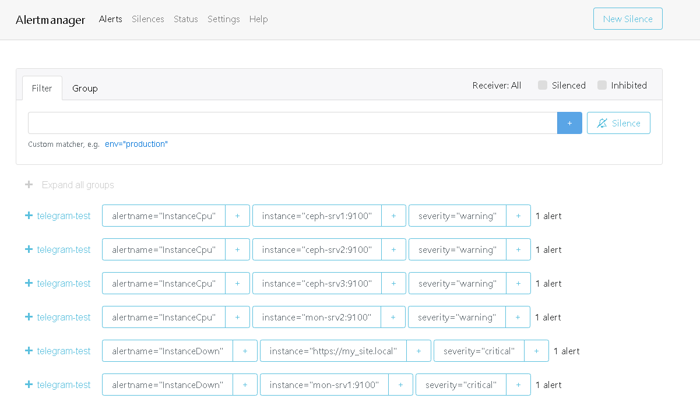

## Реализация отказоустойчивого веб-сервиса в составе: HAPROXY, WordPress, MySQL Percona XtraDB Cluster, Сeph с мониторингом средствами Prometheus, Grafana Loki, Grafana

#### Развернут стенд на виртуальных машинах в следующем составе.

### 1. Ceph

### 2. MySQL Percona XtraDB Cluster

### 3. WEB

### 3. HAPROXY

### 4. MONITIRING

- Pacemacer\Coresync Cluster

- Prometheus

- Grafana

- Alertmanager 

- telegram

- Loki

